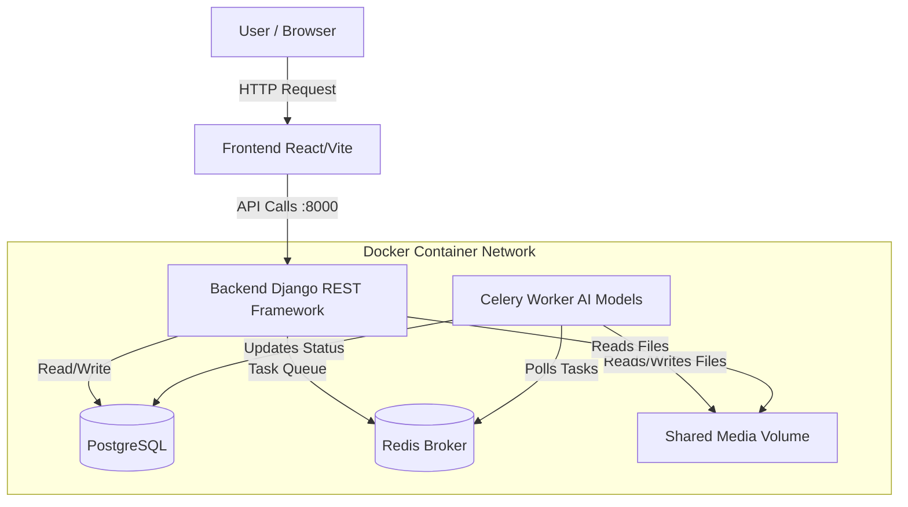

# Football Match Analysis App

An end-to-end system that automatically analyzes short football match videos using computer vision, providing deep tactical insights through a modern, interactive web interface.

## Project Goal

To create an automated football match analysis system that accelerates tactical analysis for coaches, analysts, and passionate fans through AI-powered computer vision and an intuitive web interface.

## Key Features

### Core Pipeline (Intelligent Video Analysis)

- **Object Detection & Tracking**: Uses YOLOv8 to detect players, referees, goalkeepers, and the ball, combined with ByteTrack to maintain consistent IDs across frames
- **Team Identification**: Identifies teams by analyzing colors and appearance using CLIP embeddings
- **Pitch Mapping**: Detects pitch keypoints and landmarks to map player movement and events to real-world field coordinates
- **Asynchronous Processing**: Handles video uploads (maximum 30 seconds) via Django and queues processing tasks using Celery/Redis

### Visualization Outputs

- **Player/Team Detections**: Annotated video showing bounding ellipses, ball control indicators, and team markers
- **Tactical Board**: A simplified, animated view mapping player positions to a standardized pitch diagram
- **Voronoi Maps**: Visual representation of team space control and dominance over the field

## System Architecture



### Technology Stack

| Layer | Technology | Purpose |
|-------|-----------|---------|
| **Frontend** | React + Vite | User interface for file upload, interactive visualization, and HTTP Polling for status updates |
| **Backend/API** | Django + DRF | API endpoints, database models (VideoJob), and serving media outputs |
| **Asynchronous Tasks** | Celery | Executes the heavy, GPU-accelerated computer vision pipeline |
| **Task Broker/Cache** | Redis | Message broker for Celery |
| **Database** | PostgreSQL | Persistent storage for job records, users, and Django data |
| **Computer Vision** | PyTorch + YOLOv8 + OpenCV | Core modules for detection, tracking, and video I/O |
| **Containerization** | Docker + Docker Compose | Orchestrates all services, providing networking and resource isolation |

## API Reference

The backend provides a RESTful API for managing video analysis jobs.

### Jobs Management

| Method | Endpoint | Description |
|--------|----------|-------------|
| `GET` | `/api/jobs/` | Returns a list of all analysis jobs (paginated) |
| `POST` | `/api/jobs/` | Upload a new video to start analysis |
| `GET` | `/api/jobs/{id}/` | Get the status and details of a specific job |
| `DELETE` | `/api/jobs/{id}/` | Delete a job and its associated files |

#### POST /api/jobs/ Parameters

- **file** (Required, Multipart/Form-data): The video file to analyze
  - **Constraints**: Max duration 30 seconds. Allowed formats: `.mp4`, `.mov`, `.avi`
- **produce** (Optional, Query Param): A comma-separated list of analysis types to perform
  - **Options**: `detections`, `pitch_edges`, `tactical_board`, `voronoi`
  - **Default**: `detections`

### Results & Downloads

| Method | Endpoint | Description |
|--------|----------|-------------|
| `GET` | `/api/jobs/{id}/files/` | Returns a JSON object listing all generated output files with absolute URLs |
| `GET` | `/api/jobs/{id}/download/` | Downloads the results. Returns a single file or a ZIP archive |

#### GET /api/jobs/{id}/download/ Parameters

- **which** (Optional, Query Param): Specific output key to download
  - If omitted, downloads all generated files as a `.zip`
  - If specified, downloads the specific file (e.g., `?which=detections`)
  - You can select multiple keys via comma separation (e.g., `?which=detections,voronoi`)

## Local Development Setup

### Prerequisites

- **Git** (for version control)
- **Docker** (v20.10.0+ required)
- **Docker Compose** (v2.x is standard)
- **NVIDIA GPU & NVIDIA Container Toolkit** (Highly recommended for video processing speed; CPU fallback is available)

### Installation & Running

1. **Clone the repository:**

```bash
git clone https://github.com/Trolom/FootballAnalysisApp.git
cd FootballAnalysisApp
```

2. **Add AI Models:**

Place `player_detection.pt` and your pitch model into the `backend/models/` directory.

3. **Start the System:**

**Mac/Windows (No NVIDIA GPU):**
```bash
docker compose -f docker-compose.yml -f docker-compose.cpu.yml up --build
```

**Linux (With NVIDIA GPU):**
```bash
docker compose up --build
```

### Accessing the Application

| Service | Access Point | Notes |
|---------|--------------|-------|
| **Frontend UI** | http://localhost:5173 | The main user interface for uploads and viewing status |
| **Django API** | http://localhost:8000 | The backend API root (used by the frontend) |
| **Worker Logs** | `docker compose logs -f celery_worker` | View real-time progress of video analysis tasks |

## Validation & Security Features

- **Input Validation**: Videos are strictly validated for format (MP4/MOV/AVI) and duration (max 30s) at the API level before processing begins
- **Secrets Management**: Sensitive credentials (DB passwords, Secret Keys) are managed via `.env` files and environment variables, ensuring they are not hardcoded
- **CI/CD**: An automated testing pipeline (GitHub Actions) runs unit tests and system checks on every push to ensure stability